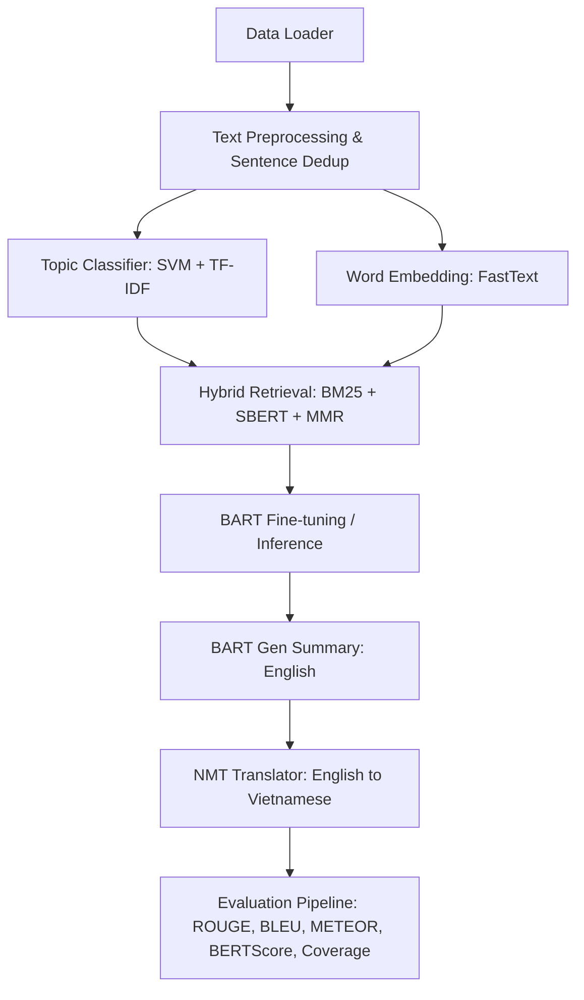

# NLP Summarization & Translation Pipeline (v6.1 - Maximum Accuracy)
> **Dự án được thực hiện bởi:** Junior AI Engineer 
> **Mục tiêu:** Xây dựng hệ thống lai (Hybrid Pipeline) tự động phân loại, truy xuất thông tin, tóm tắt văn bản tiếng Anh (BART Fine-tuned) và dịch song song sang tiếng Việt (NMT) với độ chính xác tối đa.

Hệ thống kết hợp các kỹ thuật SOTA như **Dense & Sparse Retrieval (SBERT + BM25)**, **MMR (Maximal Marginal Relevance)** để lọc trùng lặp, **BART Fine-tuning** tối ưu với Label Smoothing & FP16, cùng với mô hình **NMT** dịch ở cấp độ câu để bảo lưu thực thể (Entity Preservation).

---

## 🧭 Sơ đồ hoạt động của Pipeline



---

## 📁 Cấu trúc các Module trong Dự án

Dưới đây là các file mã nguồn tớ đã chia nhỏ và tối ưu hóa theo mô hình hướng module:

| File nguồn | Vai trò của Module | Chi tiết kỹ thuật |
| :--- | :--- | :--- |
| **[config.py](file:///c:/Users/dellcuatri142/Downloads/Test%20Summarization/config.py)** | Quản lý cấu hình dự án | Cấu hình siêu tham số (Hyperparameters), đường dẫn dữ liệu, batch size, thiết bị chạy (CPU/CUDA), cấu hình huấn luyện. |
| **[data_loader.py](file:///c:/Users/dellcuatri142/Downloads/Test%20Summarization/data_loader.py)** | Tải dữ liệu đầu vào | Tải các file `.src` (tài liệu gốc) và `.tgt` (bản tóm tắt chuẩn) từ thư mục dữ liệu, ưu tiên nạp file đã làm sạch. |
| **[preprocessing.py](file:///c:/Users/dellcuatri142/Downloads/Test%20Summarization/preprocessing.py)** | Tiền xử lý dữ liệu thô | Xóa bỏ ký tự rác từ crawler, thực hiện **Sentence Deduplication** (loại bỏ các câu trùng lặp để tránh hiện tượng lặp từ khi sinh văn bản). |
| **[document_classifier.py](file:///c:/Users/dellcuatri142/Downloads/Test%20Summarization/document_classifier.py)** | Phân loại chủ đề tài liệu | Sử dụng thuật toán **LinearSVC (SVM) + TF-IDF Vectorizer** để phân loại chủ đề (Politics, Technology, Business, General) giúp định hướng truy xuất. |
| **[embedding.py](file:///c:/Users/dellcuatri142/Downloads/Test%20Summarization/embedding.py)** | Biểu diễn từ chuyên sâu | Huấn luyện mô hình **FastText** (gensim) từ đầu hoặc tải từ Disk Cache để sinh vector từ, hỗ trợ tốt cho việc xử lý từ ngoài từ điển (OOV). |
| **[information_retrieval.py](file:///c:/Users/dellcuatri142/Downloads/Test%20Summarization/information_retrieval.py)** | Truy xuất thông tin lai | Kết hợp **BM25** (truy xuất thưa) và **SBERT** (truy xuất dày), sử dụng thuật toán **MMR** nhằm tăng tính đa dạng của ngữ cảnh đầu vào cho BART. |
| **[bart_finetuner.py](file:///c:/Users/dellcuatri142/Downloads/Test%20Summarization/bart_finetuner.py)** | Tinh chỉnh mô hình BART | Chứa Class huấn luyện BART với cơ chế **Label Smoothing (ε=0.1)** giúp chống overfitting và **Mixed Precision (FP16)** tối ưu bộ nhớ GPU. |
| **[summarization_bart.py](file:///c:/Users/dellcuatri142/Downloads/Test%20Summarization/summarization_bart.py)** | Bộ sinh tóm tắt (English) | Chạy mô hình BART sau tinh chỉnh với **Beam Search** kết hợp **Dynamic Length Ratio** (điều chỉnh độ dài tóm tắt động theo tài liệu đầu vào). |
| **[translation_nmt.py](file:///c:/Users/dellcuatri142/Downloads/Test%20Summarization/translation_nmt.py)** | Dịch máy sang Tiếng Việt | Dịch cấp độ câu (Sentence-level translation) bằng `Helsinki-NLP/opus-mt-en-vi`, tích hợp hậu xử lý làm mượt văn phong tiếng Việt. |
| **[evaluation_metrics.py](file:///c:/Users/dellcuatri142/Downloads/Test%20Summarization/evaluation_metrics.py)** | Đánh giá chất lượng đầu ra | Đo đạc đầy đủ các chỉ số: **ROUGE-1/2/L, BLEU, METEOR, BERTScore**, tỷ lệ bao phủ từ khóa (**Keyword Coverage**) và độ lặp thừa (**Redundancy**). |
| **[main_pipeline.py](file:///c:/Users/dellcuatri142/Downloads/Test%20Summarization/main_pipeline.py)** | File thực thi chính | Kết nối và chạy tuần tự toàn bộ 9 bước trên, xuất báo cáo tổng quan và đo đạc thời gian chạy (Timing Analysis) của từng bước. |

---

## 🛠 Hướng dẫn thiết lập & Chạy dự án

### 1. Chuẩn bị môi trường
Khuyên dùng Python từ **3.8** đến **3.11**. Tạo và kích hoạt môi trường ảo:
```bash
# Tạo virtual environment
python -m venv venv

# Kích hoạt trên Windows (PowerShell):
.\venv\Scripts\Activate.ps1
```

### 2. Cài đặt các thư viện phụ thuộc
Cài đặt các thư viện cần thiết cho các mô hình AI và xử lý ngôn ngữ tự nhiên:
```bash
pip install torch torchvision torchaudio --index-url https://download.pytorch.org/whl/cu118
pip install transformers sentence-transformers rank_bm25 scikit-learn nltk gensim evaluate bert-score rouge-score
```

*Lưu ý: Nếu không có GPU hỗ trợ CUDA, PyTorch sẽ tự động chạy trên CPU.*

### 3. Cấu hình Dữ liệu (`config.py`)
Mở file [config.py](file:///c:/Users/dellcuatri142/Downloads/Test%20Summarization/config.py) và điều chỉnh đường dẫn dữ liệu tại biến `self.DATA_DIR`.
Dự án yêu cầu các file dữ liệu tương ứng nằm trong thư mục này:
* `train.src` & `train.tgt` (Dữ liệu huấn luyện)
* `val.src` & `val.tgt` (Dữ liệu validation)
* `test.src` & `test.tgt` (Dữ liệu kiểm thử)

### 4. Chạy Pipeline
Sau khi cài đặt môi trường và cấu hình xong đường dẫn dữ liệu, chạy trực tiếp file pipeline:
```bash
python main_pipeline.py
```

Hệ thống sẽ chạy tuần tự từ bước [1/9] đến [9/9]. Kết thúc chương trình sẽ in ra:
1. Kết quả tóm tắt chi tiết (gồm tài liệu gốc, tóm tắt tiếng Anh, dịch tiếng Việt, và điểm số của từng mẫu thử nghiệm).
2. Bảng thống kê thời gian thực thi của từng module dưới dạng đồ thị thanh ngang trực quan.

---

## 📊 Bộ Chỉ số Đánh giá Chất lượng (Evaluation Metrics)

Hệ thống đánh giá sản phẩm đầu ra dựa trên các khía cạnh:
* **ROUGE (1, 2, L):** So sánh mức độ trùng khớp n-gram giữa bản dịch máy và bản dịch chuẩn do con người viết.
* **BLEU & METEOR:** Đánh giá độ chính xác và độ mượt mà của câu từ dựa trên sự đồng nghĩa và căn chỉnh từ.
* **BERTScore:** Đánh giá độ tương đồng ngữ nghĩa sâu (Semantic Similarity) bằng cách so sánh các embeddings ngữ cảnh từ mô hình BERT (tránh việc chấm điểm sai lệch khi dịch dùng từ đồng nghĩa).
* **Keyword Coverage:** Đo lường tỷ lệ các từ khóa quan trọng (trích xuất bằng TF-IDF) từ tài liệu gốc được giữ lại trong bản tóm tắt.
* **Redundancy Score:** Đánh giá tỷ lệ n-gram bị lặp lại trong câu để kiểm soát chất lượng văn bản sinh ra.

---

## 💡Hướng cải tiến
* **Xử lý OOV:** FastText hoạt động rất tốt trong việc biểu diễn vector các từ chưa từng thấy trong quá trình train nhờ cơ chế character n-grams.
* **Tối ưu tốc độ:** Việc áp dụng Disk Cache cho SBERT Embeddings và FastText giúp giảm thời gian khởi chạy từ lần thứ 2 xuống gần 90%.
* **Hướng phát triển:** 
  - Trong tương lai, tớ dự kiến sẽ thử nghiệm thay thế mô hình BART nhỏ bằng các LLM lớn hơn (như LLaMA-3 hoặc GPT-4o-mini thông qua API) để xem độ phủ thông tin có tăng lên không.
  - Cải thiện phần dịch thuật NMT đối với các thuật ngữ chuyên ngành (Tech/Finance) bằng phương pháp dictionary-guided translation.
